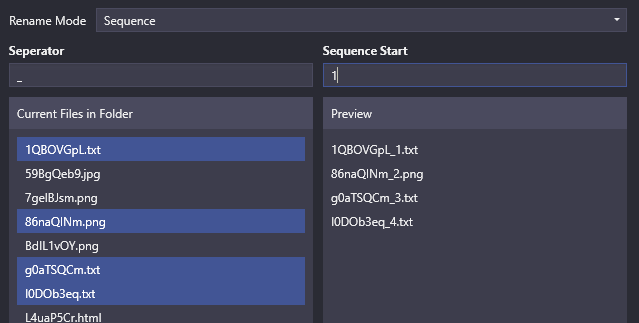
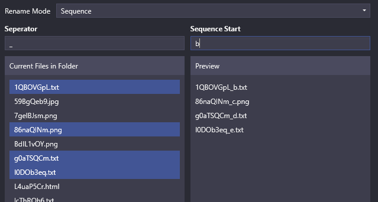
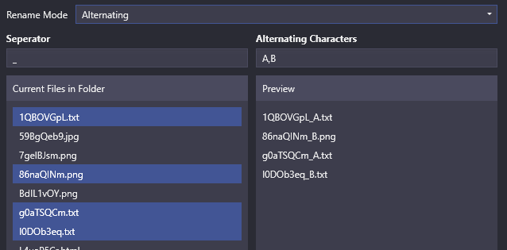

# FileRename

This wpf application makes it easier to batch rename files on your local file system.

## Available modes

### Sequence

Selected files will be renamed in sequencial order based on the start
Sequence mode can accept numbers and alphabet characters, but alphabet characters are limited to length of 1.

Using numbers as starting



Using alphabet character as starting



### Alternating

Selected files will be renamed in an alternating order based on the characters provided. Alternating characters must be provided and seperated by comma.



## Testing

use `generateTestFiles.sh` to generate test files in a specific directory

```bash
sh generateTestFiles.sh <directory> <numOfFiles>
```

# TODO 

export option
rename entire files + sequence / alternating
if only file renaming stuff could just targer numbers only